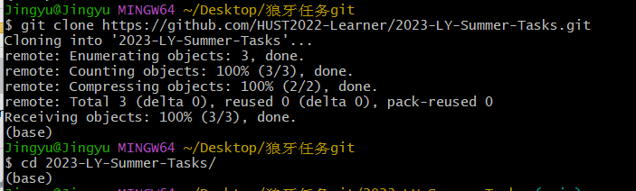
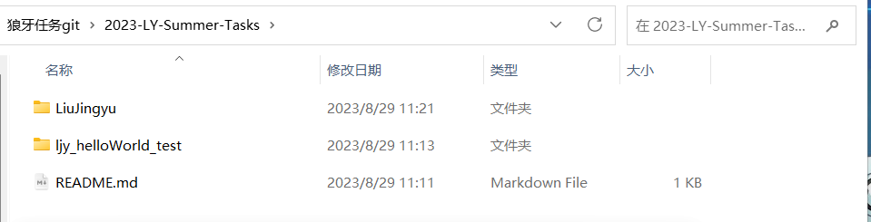
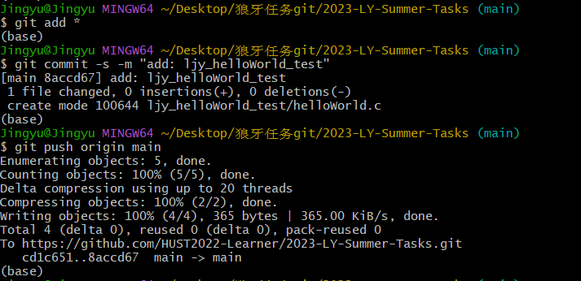

# 2023-LY-Summer-Tasks
2023年狼牙战队算法组暑期任务

## 提交方式

以`ljy_helloWorld_test`为例：

首先，在本地新建一个Document专用的文件夹（可以用之前一直使用的）

#### 第一步，克隆仓库

```shell
https://github.com/HUST2022-Learner/2023-LY-Summer-Tasks.git
```

参考如下示例：



#### 第二步，新建自己的文件夹

使用自己名字的全拼，例如：LiuJingyu，见下图：



然后，将自己的任务内容上传到自己刚刚新建的文件夹中

#### 第三部，上传自己的任务到仓库中

如果出现上传不成功的示例，可能是因为没有绑定github账户等原因，自行百度，也可参考如下内容：

[git commit 命令 | 菜鸟教程 (runoob.com)](https://www.runoob.com/git/git-commit.html)

```shell
git add *
git commit -s -m "xxx"
git push origin main
```

参考如下示例：



